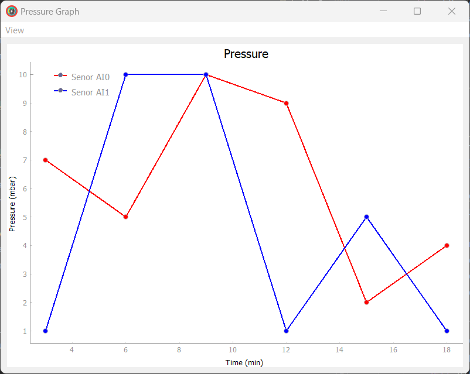

# NIDAQ-Based Pressure Reading Interface for Agilent FRG-700/702

 This project features a Graphical User Interface (GUI) designed for reading and monitoring pressure using Agilent Inverted Magnetron Pirani Gauges FRG-700 and FRG-702, interfaced through National Instruments Data Acquisition (NIDAQ) devices.
### Features

- **Real-Time Pressure Plotting**: Continuously plot pressure values at regular intervals for live monitoring.
- **Data Export**: Export recorded pressure data to an Excel file for further analysis.
- **Multi-Sensor Support**: View and manage data from multiple pressure sensors simultaneously.

### Overview

The GUI provides a user-friendly interface to efficiently monitor pressure readings from multiple Agilent FRG-700/702 sensors. It ensures accurate data collection and offers flexible options for data visualization and export, making it an essential tool for laboratory and industrial applications.

  

